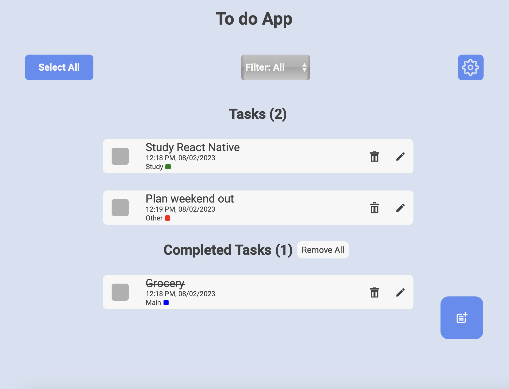
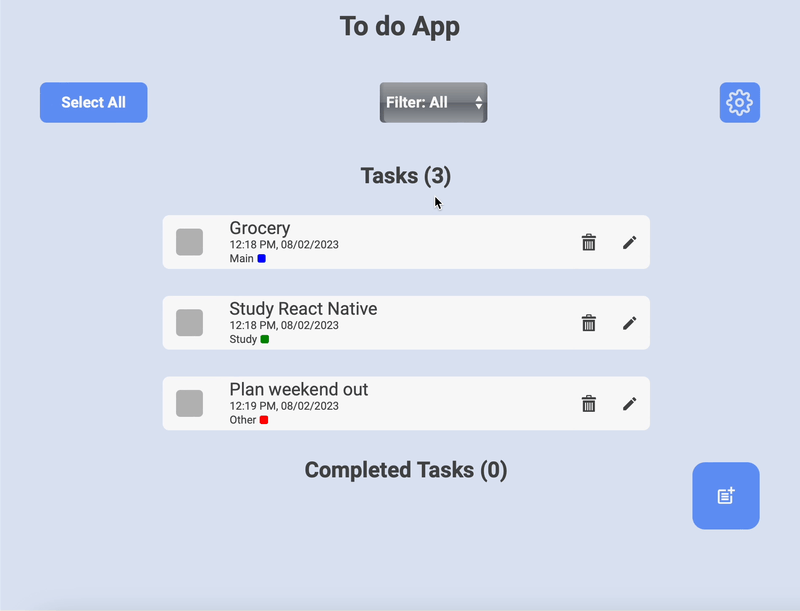
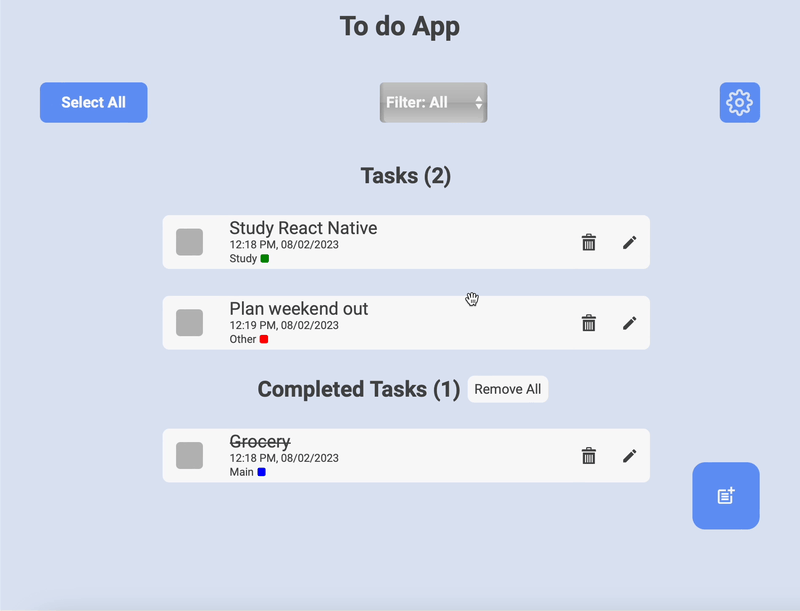
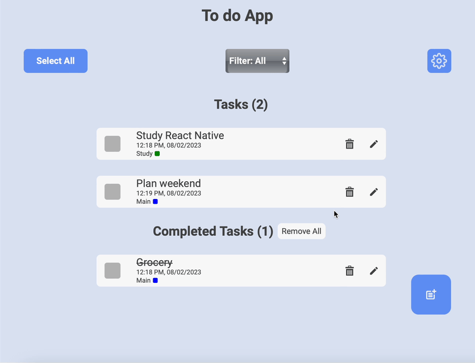

<a name="readme-top"></a>


<!-- PROJECT LOGO -->
<br />
<div align="center">
  <a href="https://github.com/Stefanocalo/to-do-app">
    
  </a>

<h3 align="center">Reddit Client</h3>

  <p align="center">
    A straight forward Reddit Client using Reddit JSON api.
    <br />
    <a href="https://github.com/Stefanocalo/to-do-app"><strong>Explore the docs »</strong></a>
    <br />
    <br />
    <a href="https://to-do-task-app.netlify.app">View Demo</a>
    ·
    <a href="https://github.com/Stefanocalo/to-do-app/issues">Report Bug</a>
    ·
    <a href="https://github.com/Stefanocalo/to-do-app/issues">Request Feature</a>
  </p>
</div>


<!-- TABLE OF CONTENTS -->
<details>
  <summary>Table of Contents</summary>
  <ol>
    <li>
      <a href="#about-the-project">About The Project</a>
      <ul>
        <li><a href="#built-with">Built With</a></li>
      </ul>
    </li>
    <li>
      <a href="#getting-started">Getting Started</a>
      <ul>
        <li><a href="#prerequisites">Prerequisites</a></li>
        <li><a href="#installation">Installation</a></li>
      </ul>
    </li>
    <li><a href="#usage">Usage</a></li>
    <li><a href="#contributing">Contributing</a></li>
    <li><a href="#contact">Contact</a></li>
  </ol>
</details>


<!-- ABOUT THE PROJECT -->
## About The Project



A To Do App to make your life easier. 

Feel free to organise your tasks with different tags and choose to filter a particular task if you want to focus on particular tasks.

From today also supporting theming! Choose between a variety of different light and dark themes.

<p align="right">(<a href="#readme-top">back to top</a>)</p>


### Built With

<br>

* [![React][React.js]][React-url]

<br>

<p align="right">(<a href="#readme-top">back to top</a>)</p>


<!-- GETTING STARTED -->
## Getting Started

This is an example of how you may give instructions on setting up your project locally.
To get a local copy up and running follow these simple example steps.

### Prerequisites

This is an example of how to list things you need to use the software and how to install them.
* npm
  ```sh
  npm install npm@latest -g
  ```

### Installation

1. Get a free API Key at [https://openai.com](https://openai.com)
2. Clone the repo
   ```sh
   git clone https://github.com/github_username/repo_name.git
   ```
3. Install NPM packages
   ```sh
   npm install
   ```


<p align="right">(<a href="#readme-top">back to top</a>)</p>

<!-- USAGE EXAMPLES -->
## Usage

Start adding todo and different tags with the add buttom on the bottom left of your screen. The just swipe a todo to flag it as complete!



You can also select multiple todo just by clicking on the empty box on the left side of the todo title or select all with the convinient button on the top left corner of the screen.



Update Task and tags by simply tapping the "pen" icon on the far right of the todo card.



Choose betwenn a variety of both light and dark theme without the necessity to reloadthe app!


<br>

<p align="right">(<a href="#readme-top">back to top</a>)</p>

<!-- CONTRIBUTING -->
## Contributing

Contributions are what make the open source community such an amazing place to learn, inspire, and create. Any contributions you make are **greatly appreciated**.

If you have a suggestion that would make this better, please fork the repo and create a pull request. You can also simply open an issue with the tag "enhancement".
Don't forget to give the project a star! Thanks again!

1. Fork the Project
2. Create your Feature Branch (`git checkout -b feature/AmazingFeature`)
3. Commit your Changes (`git commit -m 'Add some AmazingFeature'`)
4. Push to the Branch (`git push origin feature/AmazingFeature`)
5. Open a Pull Request

<p align="right">(<a href="#readme-top">back to top</a>)</p>

<!-- CONTACT -->
## Contact

Stefano Calò - stefano.cal92@gmail.com

Project Link: [https://github.com/Stefanocalo/to-do-app](https://github.com/Stefanocalo/to-do-app)

<p align="right">(<a href="#readme-top">back to top</a>)</p>


<!-- MARKDOWN LINKS & IMAGES -->
<!-- https://www.markdownguide.org/basic-syntax/#reference-style-links -->

[React.js]: https://img.shields.io/badge/React-20232A?style=for-the-badge&logo=react&logoColor=61DAFB
[React-url]: https://reactjs.org/